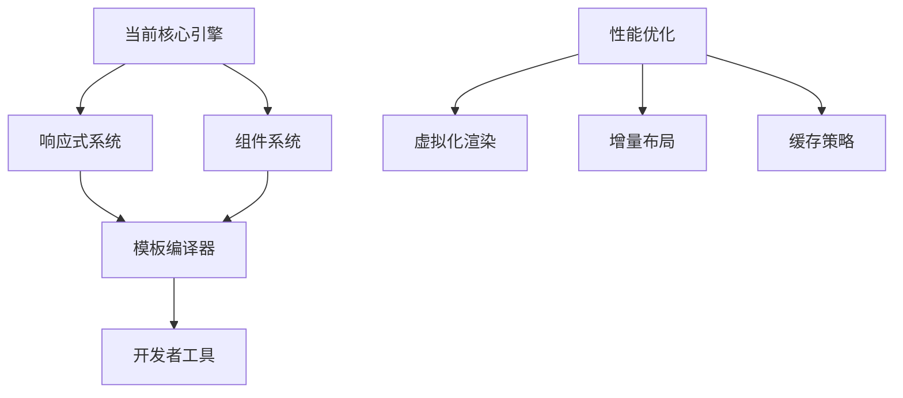

# Vuvas 架构方案

## 项目定位

**"Canvas 上的 Vue"** —— 一个面向 Canvas 的渐进式 UI 框架。

让开发者能用类似 Vue 的开发体验（响应式数据、组件化、模板语法），来编写最终渲染在 Canvas 上的 UI。开发者写的代码**看起来就像在写 HTML/CSS + Vue**，但底层跑的不是 DOM，而是 Canvas。

### 核心理念

```
传统 Vue 开发：  模板/组件 → Vue 运行时 → DOM 渲染
Vuvas：       模板/组件 → 类 Vue 运行时 → Canvas 渲染
```

对开发者来说，**上层写法几乎一样**，只是渲染目标从 DOM 换成了 Canvas。这意味着：
- 会 Vue + HTML/CSS 就能上手，零学习成本
- 获得 Canvas 的优势：跨端一致、可导出图片、高性能自绘
- 适用于 DOM 不可用或不够好的场景（小程序、游戏UI、海报生成、嵌入式设备等）

### 解决的问题

| 问题 | 说明 |
|------|------|
| 跨端 UI 一致性 | 小程序、游戏引擎、嵌入式等环境没有 DOM，但开发者熟悉 HTML/CSS |
| 高性能渲染 | DOM 节点数量极大时重排重绘成本高，Canvas 自绘可绕过瓶颈 |
| 图片/海报生成 | Canvas 是唯一选择，但手动绘制太痛苦 |
| 开发体验断层 | 现有 Canvas 库需要手动定位、没有布局系统、没有响应式 |

## 核心架构

```
用户代码(模板/组件) → 编译器/解析器 → VNode Tree → 布局引擎(Flexbox) → Canvas 渲染 → 事件系统(Hit Testing)
                                          ↑                                                        ↓
                                          └──────────── 响应式系统(Proxy) ←─────────────────────────┘
```

## 模块划分

| 模块 | 职责 | 说明 |
|------|------|------|
| **Core/Renderer** | Canvas 渲染 | 矩形、文本、图片、圆角、阴影、渐变等绘制 |
| **Layout** | 布局计算 | Flexbox 布局算法（简化版自研） |
| **Event** | 事件系统 | 点击/悬停等事件的命中测试(hit-testing)和冒泡 |
| **Reactivity** | 响应式数据 | ref / reactive / computed / watch / effect |
| **Runtime** | VNode + Diff | 虚拟节点树、diff 算法、patch 更新 |
| **Component** | 组件系统 | 组件定义、生命周期、props/emit |
| **Compiler** | 模板编译 | 模板语法解析（阶段三） |

## 技术选型

- **语言**: TypeScript
- **构建工具**: Vite
- **包管理**: pnpm (monorepo)
- **布局算法**: 自研简化版 Flexbox（后续可接入 yoga-wasm）
- **测试**: Vitest

## 渐进式路线

### 阶段一：核心引擎 + Demo（当前）

1. Canvas 渲染引擎（矩形、文本、圆角、阴影、背景色）
2. 简化版 Flexbox 布局（direction, justify, align, gap, padding）
3. 事件系统（click, hover 的 hit-testing + 冒泡）
4. Demo 页面展示能力

### 阶段二：响应式框架

1. 响应式系统：ref / reactive / computed / watch
2. VNode 虚拟节点 + h() 函数
3. Diff + Patch 更新机制
4. 组件生命周期（onMounted, onUpdated, onUnmounted）
5. Scheduler 调度器（批量更新）

### 阶段三：模板编译 + 生态

1. 模板解析器（{{ }} 插值、v-if、v-for、@event）
2. SFC 编译（.hic 文件）
3. Vite 插件支持热更新
4. 动画系统
5. 开发者工具

## 项目结构

```
vuvas/
├── packages/
│   ├── core/              # 核心渲染引擎
│   │   ├── src/
│   │   │   ├── renderer.ts        # Canvas 绘制
│   │   │   ├── layout.ts          # 布局计算
│   │   │   ├── event.ts           # 事件系统
│   │   │   ├── node.ts            # 节点定义
│   │   │   └── index.ts
│   │   └── package.json
│   ├── reactivity/        # 响应式系统（阶段二）
│   ├── runtime/           # 运行时 VNode + 组件（阶段二）
│   └── compiler/          # 模板编译器（阶段三）
├── demo/                  # Demo 页面
│   ├── index.html
│   └── main.ts
├── docs/                  # 文档
│   ├── ARCHITECTURE.md
│   └── TASKS.md
├── package.json
├── tsconfig.json
└── vite.config.ts
```

## API 设计预览

### 阶段一（命令式）

```typescript
import { createCanvas, View, Text, Button } from '@vuvas/core'

const app = createCanvas('#my-canvas', { width: 800, height: 600 })

const container = new View({
  style: { display: 'flex', flexDirection: 'column', padding: 20, gap: 10 }
})

const title = new Text('Hello Vuvas!', {
  style: { fontSize: 24, color: '#333', fontWeight: 'bold' }
})

const btn = new Button('Click me', {
  style: { padding: [8, 16], background: '#42b883', color: '#fff', borderRadius: 4 }
})

btn.on('click', () => console.log('clicked!'))

container.append(title, btn)
app.mount(container)
```

### 阶段二（响应式）

```typescript
import { createApp, ref, h } from 'vuvas'

const Counter = () => {
  const count = ref(0)
  return () => h('view', { style: { display: 'flex', gap: 10 } }, [
    h('text', {}, `Count: ${count.value}`),
    h('button', { onClick: () => count.value++ }, '+1')
  ])
}

createApp(Counter).mount('#canvas')
```

## 差异化优势

| 对比项 | Vuvas | Konva/Fabric.js | PixiJS |
|--------|---------------|-----------------|--------|
| 定位 | Canvas 上的 Vue | 图形库 | 游戏引擎 |
| 布局 | Flexbox（类 CSS） | 手动定位 | 手动定位 |
| 响应式 | 内置（类 Vue3） | 无 | 无 |
| 组件化 | 类 Vue SFC | 无 | 无 |
| 模板语法 | 支持（v-if/v-for） | 无 | 无 |
| 学习成本 | 极低（会 Vue 就会） | 中 | 高 |
| 适用场景 | 跨端UI/海报/游戏UI/小程序 | 画板/图表 | 游戏 |

## 与 Vue 的技术差异分析

### 核心架构差异

```typescript
// Vue 的渲染流程（DOM 依赖）
Template → VNode → DOM API (createElement, setAttribute, appendChild)

// Vuvas 的渲染流程（Canvas 原生）
Template → VNode → Canvas API (fillRect, fillText, drawImage)
```

### 关键技术差异点

| 技术维度 | Vue（DOM 环境） | Vuvas（Canvas 环境） |
|----------|----------------|---------------------|
| **渲染目标** | 浏览器 DOM 树 | Canvas 2D 上下文 |
| **布局系统** | 浏览器 CSS 引擎 | 自研 Flexbox 布局算法 |
| **事件系统** | DOM 事件冒泡机制 | 命中测试（Hit Testing）算法 |
| **更新机制** | DOM diff + patch | Canvas 重绘 + 脏区域优化 |
| **文本渲染** | 浏览器字体渲染 | Canvas text API + 字体测量 |
| **样式继承** | CSS 层叠继承 | 手动样式合并逻辑 |

### 为什么不是 Vue 的 Canvas 适配层

**技术可行性分析：**
- **架构耦合**：Vue 深度依赖 DOM API，适配层复杂度高
- **性能损失**：DOM → VNode → Canvas 的转换开销大
- **功能限制**：无法充分利用 Canvas 特有功能（如像素操作）
- **体积臃肿**：包含大量 DOM 相关但 Canvas 不需要的代码

**技术路线选择：**
- ✅ **参考 Vue 思想**：学习响应式、组件化、模板语法设计
- ❌ **复用 Vue 源码**：DOM 依赖导致架构不匹配
- ✅ **独立实现**：针对 Canvas 优化的轻量级框架

## 核心价值定位

### 1. 技术定位：Canvas 领域的 Vue-like 解决方案
- **不是 Vue 的替代品**，而是特定场景的补充
- **专注 Canvas UI**，不做通用 Web 框架
- **轻量级设计**，比 Vue + Canvas 适配层更高效

### 2. 场景定位：DOM 不可用或不够好的场景

**核心应用场景：**
- **跨端 UI 一致性**：小程序、游戏引擎、嵌入式设备
- **高性能渲染**：大量动态 UI 元素的场景
- **图片/海报生成**：服务端渲染、批量生成
- **特殊环境**：WebGL 叠加层、浏览器扩展

### 3. 开发者体验定位：零学习成本的 Canvas 开发

**对 Vue 开发者：**
- 熟悉的 API 设计（Composition API、SFC）
- 相同的开发思维模式（响应式、组件化）
- 平滑的学习曲线（从 DOM 到 Canvas）

**对 Canvas 开发者：**
- 告别手动坐标计算的痛苦
- 获得现代前端框架的开发体验
- 更好的代码组织和维护性

## 技术演进策略

### 渐进式架构设计



### 性能优化优先于多线程

**当前阶段不推荐多线程原因：**
- Canvas 上下文无法在 Worker 中直接操作
- 消息传递开销可能抵消性能收益
- 当前瓶颈主要在布局计算而非渲染

**优化策略：**
- 增量更新（脏区域重绘）
- 虚拟化渲染（可视区域优化）
- 布局计算缓存
- 按需渲染调度

## 目标用户

- 熟悉 Vue + HTML/CSS 的前端开发者
- 需要在 Canvas 中构建 UI 但不想手动计算坐标的开发者
- 需要跨端一致 UI 渲染的团队
- 需要生成图片/海报的业务场景
