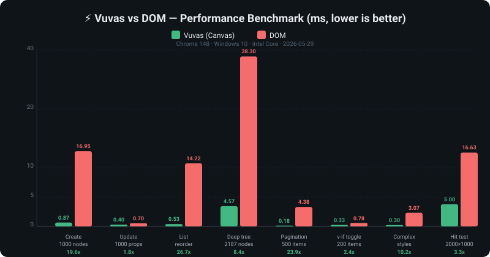

# Vuvas

> /vjuːvæs/ — **V**(ue) + Canvas

**English** | [中文](./README.zh-CN.md)

<p align="center">
  
</p>

<p align="center">
  <strong>Vue on Canvas</strong> — A progressive UI framework for Canvas
</p>

<p align="center">
  Build interfaces in Canvas with zero learning curve for Web developers
</p>

<p align="center">
  <a href="https://github.com/Cyrios-ykx/Vuvas/actions/workflows/ci.yml"></a>
  <a href="./LICENSE"></a>
  
  
</p>

<p align="center">
  <a href="https://cyrios-ykx.github.io/Vuvas/">📺 Online Demo</a>
</p>

---

## 📊 Performance

<p align="center">
  
</p>

<p align="center">
  <em>Average <strong>12x faster</strong> than DOM across 8 benchmark tests</em><br/>
  <sub>Run your own: <code>npm run dev</code> → <a href="http://localhost:3000/benchmarks/">localhost:3000/benchmarks/</a></sub>
</p>

---

## ✨ Features

- 🎨 **Vue-like DX** — Reactive data, components, template syntax. If you know Vue, you know Vuvas.
- 📐 **Flexbox Layout** — Layout like CSS, no manual coordinate calculations.
- ⚡ **Event System** — Click, hover, drag, keyboard, touch — full DOM-like event bubbling.
- 🖼️ **Canvas Rendering** — Cross-platform consistency, image export, high-performance custom drawing.
- 📦 **Progressive** — From simple imperative API to full framework, use what you need.
- 🔄 **Reactivity** — `ref`, `reactive`, `computed`, `watch` — same as Vue 3.
- 🧩 **Component System** — `defineComponent`, `setup()`, props, emit, slots, provide/inject.
- 📝 **Template Compiler** — `{{ }}`, `v-if`, `v-for`, `v-model`, `@event`, `:prop`, `v-show`.
- 📄 **Single File Component** — `.vuvas` SFC with `<template>`, `<script setup>`, `<style scoped>`.
- 🎬 **Animation** — Transition & animate with easing functions.
- 🗺️ **Router** — Hash/history mode, dynamic params, navigation guards.
- 🏪 **Store** — Pinia-like state management with `defineStore`, `$patch`, `$subscribe`.
- 🔧 **Vite Plugin** — `vite-plugin-vuvas` with HMR & Source Map support.

## 🎯 When to Use Vuvas vs Vue

| Scenario | Vuvas (Canvas) | Vue (DOM) |
|----------|---------------|-----------|
| Visual editors (Figma-like, whiteboard, flowchart) | ✅ Best fit | ❌ Painful |
| Game UI / Interactive H5 | ✅ Best fit | ⚠️ Limited |
| Image/poster generation | ✅ Native export | ⚠️ Needs hacks |
| Large-scale data panels (1000+ nodes) | ✅ Performant | ⚠️ Reflow issues |
| Cross-platform pixel-perfect rendering | ✅ Consistent | ❌ Browser differences |
| Standard web apps (admin, e-commerce) | ⚠️ Overkill | ✅ Best fit |
| SEO-required pages | ❌ Not indexable | ✅ Native support |
| Accessibility (screen readers) | ⚠️ Extra work | ✅ Native support |
| Rich text editing | ⚠️ Complex | ✅ Native support |
| Form-heavy applications | ⚠️ Limited | ✅ Best fit |

**TL;DR**: Vue → "content" apps (info display, forms, standard web). Vuvas → "canvas" apps (free positioning, pixel control, graphics-intensive, export needs).

> Vuvas's greatest value is not to "replace Vue", but to bring Vue's development experience to Canvas scenarios, lowering the barrier for building Canvas applications.

## 🚀 Quick Start

```bash
# Clone the project
git clone https://github.com/your-username/vuvas.git
cd vuvas

# Install dependencies
npm install

# Start dev server
npm run dev
```

Open `http://localhost:3000` in your browser to see the Demo.

## 📖 Example

### Imperative API

```typescript
import { createApp, CanvasNode, TextNode, ButtonNode } from 'vuvas'

const app = createApp('#my-canvas')

// Create a Flexbox container
const container = new CanvasNode({
  display: 'flex',
  flexDirection: 'column',
  padding: 20,
  gap: 10,
  background: '#ffffff'
})

// Add text
const title = new TextNode('Hello Vuvas!', {
  fontSize: 24,
  color: '#333',
  fontWeight: 'bold'
})

// Add a button (with built-in hover effect)
const btn = new ButtonNode('Click me', {
  padding: [8, 16],
  background: '#42b883',
  color: '#fff',
  borderRadius: 6
})

btn.on('click', () => console.log('Clicked!'))

container.append(title, btn)
app.mount(container)
```

### Single File Component (.vuvas)

```html
<template>
  <view :style="{ flexDirection: 'column', padding: 20, gap: 10 }">
    <text :style="{ fontSize: 24, color: '#333' }">Count: {{ count }}</text>
    <view
      @click="increment"
      :style="{ padding: [8, 16], background: '#42b883', borderRadius: 6 }"
    >
      <text :style="{ color: '#fff' }">+1</text>
    </view>
  </view>
</template>

<script setup>
import { ref } from 'vuvas'

const count = ref(0)
function increment() {
  count.value++
}
</script>

<style scoped>
view {
  background: #ffffff;
}
</style>
```

## 🗺️ Roadmap

See [TASKS.md](./TASKS.md) for the full roadmap and task tracking.

## 🏗️ Project Structure

```
vuvas/
├── src/
│   ├── core/             # Core engine
│   │   ├── node.ts       # Node definitions (styles, events)
│   │   ├── layout.ts     # Flexbox layout engine
│   │   ├── renderer.ts   # Canvas renderer
│   │   ├── event.ts      # Event system (hit-testing + bubbling)
│   │   └── index.ts      # Entry + App class
│   ├── reactivity/       # Reactivity system (ref, reactive, computed, watch)
│   │   └── index.ts
│   ├── runtime/          # Runtime (VNode, diff, patch, component)
│   │   ├── vnode.ts      # VNode types & diff algorithm
│   │   └── index.ts      # Component system & lifecycle
│   ├── compiler/         # Template compiler & SFC
│   │   ├── index.ts      # Template parser & code generator
│   │   ├── sfc.ts        # .vuvas SFC parser
│   │   ├── sourcemap.ts  # Source Map support
│   │   └── vite-plugin.ts # Vite plugin (HMR)
│   ├── animation/        # Animation system (transition, easing)
│   │   └── index.ts
│   ├── router/           # Router (hash/history, guards)
│   │   └── index.ts
│   ├── store/            # State management (Pinia-like)
│   │   └── index.ts
│   ├── scheduler/        # Batch update scheduler
│   │   └── index.ts
│   └── index.ts          # Main entry & exports
├── demo/                 # Demo page
│   └── main.ts           # Demo entry
├── ARCHITECTURE.md       # Architecture design
├── TASKS.md              # Task tracking
├── CONTRIBUTING.md       # Contributing guide
└── CHANGELOG.md          # Changelog
```

## 🤝 Contributing

Contributions of any kind are welcome! Please read [CONTRIBUTING.md](./CONTRIBUTING.md) to get started.

## 📄 License

[MIT](./LICENSE) © 2026-present Cyrios-ykx
